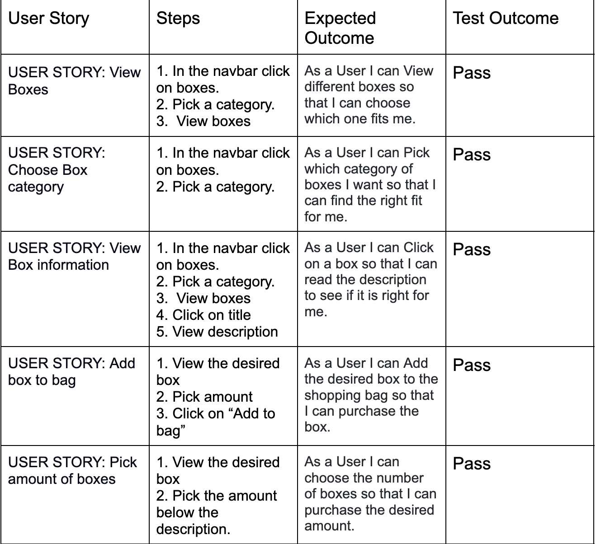
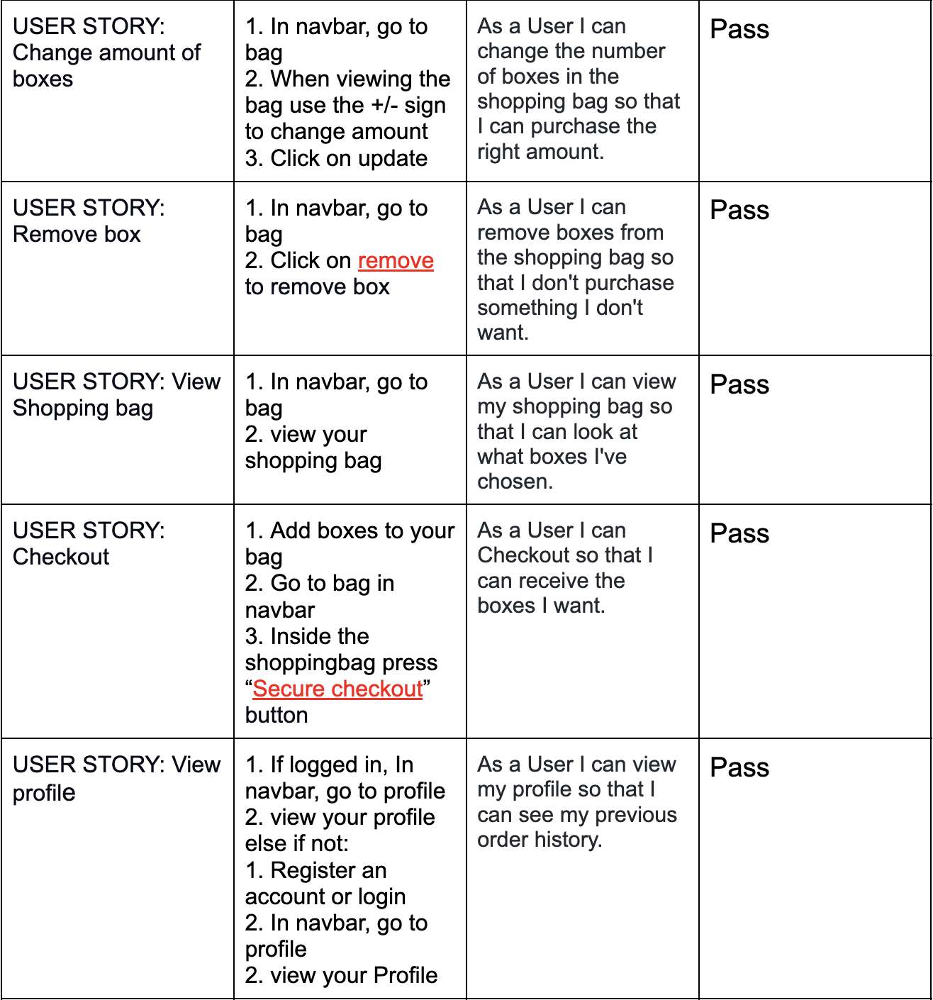
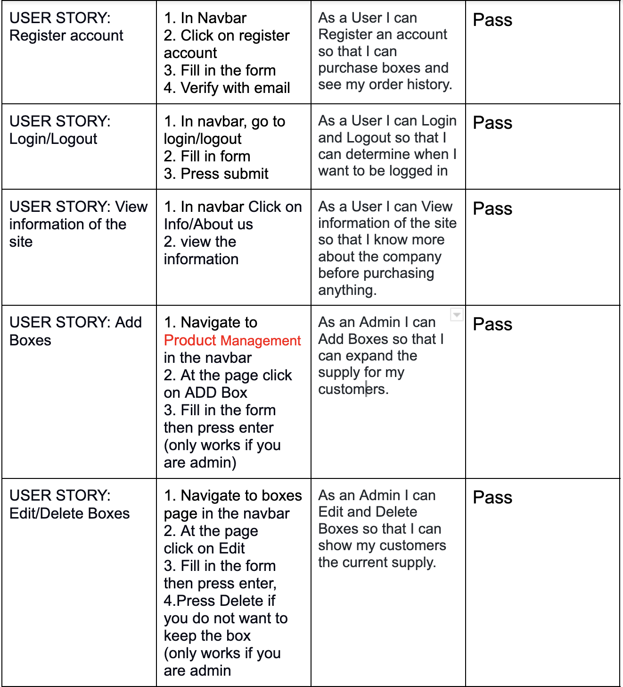
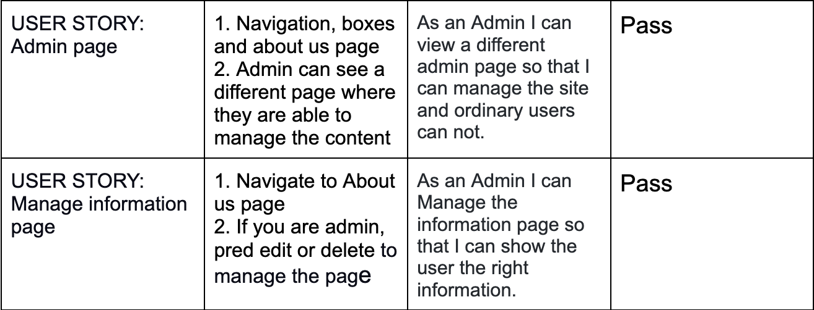

# MBoxes
---

## About
---

MBoxes is a site where you can buy food boxes to make your everyday life so much easier. With the fastest shipping, you can receive your box by tomorrow! stressing about food shopping should never be a daily struggle.

### UX (User Experience)
---

* USER STORY: View Boxes. 
    - As a User I can View different boxes so that I can choose which one fits me.
* USER STORY: Choose Box category. 
   -  As a User I can Pick which category of boxes I want so that I can find the right fit for me.
* USER STORY: View Box information.
    - As a User I can Click on a box so that I can read the description to see if it is right for me.
* USER STORY: Add box to bag.
   -  As a User I can Add the desired box to the shopping bag so that I can purchase the box.
* USER STORY: Pick amount of boxes 
    - As a User I can choose the number of boxes so that I can purchase the desired amount.
* USER STORY: Change amount of boxes.
   -  As a User I can change the number of boxes in the shopping bag so that I can purchase the right amount.
* USER STORY: Remove box
   -  As a User I can remove boxes from the shopping bag so that I don't purchase something I don't want.
* USER STORY: View Shopping bag
   -   As a User I can view my shopping bag so that I can look at what boxes I've chosen.
* USER STORY: Checkout 
    - As a User I can Checkout so that I can receive the boxes I want.
* USER STORY: View profile 
    - As a User I can view my profile so that I can see my previous order history.
* USER STORY: Register account.
    - As a User I can Register an account so that I can purchase boxes and see my order history.
* USER STORY: Login/Logout 
    - As a User I can Login and Logout so that I can determine when I want to be logged in
* USER STORY: View information of the site
    - As a User I can View information of the site so that I know more about the company before purchasing anything.
* USER STORY: Add Boxes.
    - As an Admin I can Add Boxes so that I can expand the supply for my customers.
* USER STORY: Edit/Delete Boxes
    - As an Admin I can Edit and Delete Boxes so that I can show my customers the current supply.
* USER STORY: Admin page
    - As an Admin I can view a different admin page so that I can manage the site and ordinary users can not.
* USER STORY: Manage information page
    - As a Admin I can Manage the information page so that I can show the user the right information.

### Design
---

* Wireframes
    * [HomePage]

    * [BoxesPage]

    * [DetailBoxPage]

    * [AboutPage]

    * [Login/Logout/Register]

    * [Checkout]

    * [Checkoutsuccess]

    * [Profile]

    * [Admin?]

* Mockups

### Choice of color
---

* Choice of color
    - The color scheme for the MBoxes website is Vintage mustard and earthy greens. 
- Hex codes:
    - Mustard #E3B448, 
    - Sage #CBD18F, 
    - Forest Green #3A6B35

Yellow is beneficial because it’s attention-grabbing and conveys feelings of happiness. Yellow also represents food attributes. In this modern day, green is all about the earth. Nowdays the intrest of where food comes from is more than ever.

### Responsive Design
---

    - The site is responsive to all devices (desktop, mobile, tablet)
    - The design of the web application meets accessibility guidelines, presents a structured layout and follows the principles of UX design and navigation model
    - Contrast between background and foreground colors to help the visually impaired
    - The graphics are consistent in style and color throughout the site.

## Features
---

#### Home Page

- Navigation bar
    - The navbar allows the user to navigate throughout the site and can access all allowed pages. 

- Introduction to page

- Option to subscribe to the newsletter

### Boxes Page

(categories: All boxes, breakfast, lunch, diner, special)

- Depending on what category the user choose the renders all boxes and gives the user a preview of the content of the box. By pressing the title the user will be directed to the full information of the box where they can add it to the cart if it suits their interest.
 
- If the user is an Admin they can have the option to Add, Edit and delete the boxes on the page.

### Detail Box Page

- The full detail box page, shows the user  
    - Title
    - Image
    - Full description
    - Price
    - Sice
    - Pick quantity
    - Option for Add to bag

### About Page

- On the about page the user can get information on the site to strengthen their will to purchase from the site.

- Our Team
    - Name
    - Role
    - Description

- Our Locations
    - Address

- Contact Information
    - Name
    - Email
    - Phone

If the User is an Admin they can have the option to Add, Edit and delete the informaition on the page.

### Login/Logout/Register

- In the navigationbar the user can login/logout if they have an account
    - Register if they do not have an account

### Shopping cart

- Product 
    - Name
    - Quantity
    - Price

- Information
    - Total
    - Shipping if they did not spend 65
    - Total
    - Grand/Order total
    - Delta to dree shipping if the user did not spend 65

- The user can also edit their shoppingbag
    - Delete Items
    - Change quantity

### Checkout

- Form
    - Full Name
    - Email Address
    - Phone Number
    - Country
    - Postcode (Optional)
    - Town or city
    - Street Address 1
    - Street Address 2 (Optional)
    - County (Optional)
    - Card Information

- Option to save the information to profile
- Proceed to checkout 

### Checkout success

- If the payment went through the user will be redirected to the checkout success page

### Profile User

- Default Delivery Information
    - Phone Number
    - Country
    - Town or city
    - Street Address 1
    - Street Address 2 
    - County 
- If the user want to update their information they can fill in the form and press “Update Information”

### Future features

- Make subscription plans for users
- Additional Style to buttons  

## Technologies used
---

* Languages
    * HTML.
    * CSS.
    * JavaScript.
    * Python.

* Frameworks libraries & programs Used
    * Django
    * Git
    * Github
    * Bootstrap
    * Gunicorn
    * dj_database_url
    * psycopg2
    * Cloudinary
    * Summernote
    * Django allauth
    * Django crispy forms

## Testing
---

### Validator Testing

#### [Html]()

Templates 
* bag.html
* add_box.html
* boxes.html
* detail_box.html
* edit_box.html
* checkout.html
* checkout_success.html
* about_us.html
* add_contact.html
* add_location.html
* add_team.html
* edit_contact.html
* edit_location.html
* edit_team.html
* index.html
* profile.html
* base.html
* register.html
* login.html
* logout.html

#### [CSS]()

* profile.css
* base.css

#### Javascript 

* countryfield.js
* 

#### Python

* Bag
    * [urls.py](documentation/img/Bag-url.jpg)
    * [views.py](documentation/img/Bag-views.jpg)

* Boxes
    * [admin.py](documentation/img/Boxes-admin.jpg)
    * [apps.py](documentation/img/Boxes-app.jpg)
    * [forms.py](documentation/img/Boxes-forms.jpg)
    * [models.py](documentation/img/Boxes-models.jpg)
    * [urls.py](documentation/img/Boxes-urls.jpg)
    * [views.py](documentation/img/Boxes-views.jpg)

* checkout
    * [admin.py](documentation/img/Checkout-admin.jpg)
    * [apps.py](documentation/img/Checkout-apps.jpg)
    * [forms.py](documentation/img/Checkout-forms.jpg)
    * [models.py](documentation/img/Checkout-models.jpg)
    * [signals.py](documentation/img/Checkout-signals.jpg)
    * [urls.py](documentation/img/Checkout-urls.jpg)
    * [views.py](documentation/img/Checkout-views.jpg)
    * [webhooks.py](documentation/img/Webhooks.jpg)
    * [webhook_handler.py](documentation/img/Webhook-handler.jpg)

* Home
    * [admin.py](documentation/img/Home-admin.jpg)
    * [apps.py](documentation/img/Home-apps.jpg)
    * [forms.py](documentation/img/Home-forms.jpg)
    * [models.py](documentation/img/Home-models.jpg)
    * [urls.py](documentation/img/Home-urls.jpg)
    * [views.py](documentation/img/Home-views.jpg)

* Profiles
    * [apps.py](documentation/img/Profiles-apps.jpg)
    * [forms.py](documentation/img/Profiles-forms.jpg)
    * [models.py](documentation/img/Profiles-models.jpg)
    * [urls.py](documentation/img/Profiles-urls.jpg)
    * [views.py](documentation/img/Profiles-views.jpg)

* Subscription_box
    * [urls.py](documentation/img/Subscription-box-urls.jpg)
    * [settings.py](documentation/img/Subscription-box-settings.jpg)

### Manual testing

## Deployment
---

* Deployment steps followed:
    1. Create the Heroku app .
    1. Attach the PostgreSQL
    1. Prepare environment and settings.py files
    1. Get our static and media files stored on Cloudinary

 

* Heroku
    1. “pip3 install django gunicorn” in the terminal, using gunicorn to be the server to run Django on heroku.
    1. “pip3 install dj_database_url psycopg2

 

* To run Cloudinary 
    1. pip3 install dj3-cloudinary-storage
    1. Create the requirements.txt file: pip3 freeze –local >requirements.txt

 

* To create a new Django project
    1. “django-admin start project traint .”
    1. Create the app: “python3 manage.py startapp forum”

 

* In our settings.py file
    1. in the installed app section add: “forum” 

we now need to migrate this changes to the database
in the terminal: “python3 manage.py migrate”

 

#### Creat a app in heroku

1. You need to have an account on Heroku.com
2. Create a list of requirements that the project needs to run:
    * ype in this in the terminal: pip3 freeze > requirements.txt
    * (Now all of the requirements has been updated)
    * Commit and push the changes to GitHub
3. login to your account on Heroku or create one if needed.
4. Click on your profile and then the "create new app" button.
5. You will now create an app name and select a region.
    * This project chose traint-forum and the region Europe
    * The app name needs to be unique
6. when this is done click "create app"
7. In the Resources tab, Add a database: search for postgres in the Add-ons field (Heroku Postgres)
8. Open the settings tab before you deploy the code.
9. In setting, scroll down to the config Vars section
10. copy the DATABASE_URL

 

* In the code in the same directory as the manage.py create a file named “env.py”
    1. At the top import os
    1. Set a environment variable caller DATABASE_URL  (paste in url)
    1. Add your SECRET_KEY as well 
    1. copy your secret key value and go back to Heroku config vars.
    1. Add the secret_key value to a new config var called SECRET_KEY
    1. Reference the env.py in the setings.py file, by using:
        * import os 
        * import dj_database
    1. In setings.py add secret key value:
        * SECRET_KEY = os.environ.get('SECRET_KEY')
    1. In settings scroll down to DATABASES: 
        * DATABASES = {'default': dj_database_url.parse(os.environ.get('DATABASE_URL'))

Do not forget to migrate the changes

### Cloudinary

1. Create an account
1. Click on the Sign Up For Free button
1. Provide your name, email address and choose a password
1. For Primary interest, you can choose Programmable Media for image and video API
1. Optional: edit your assigned cloud name to something more memorable
1. Click Create Account
1. Verify your email and you will be brought to the dashboard

 

1. From the dashboard, copy the "API Environment variable" value by clicking on the "Copy to clipboard" link.
1. Go back to the env.py file add the value to CLOUDINARY_URL(remember to remove CLOUDINARY_URL= in the begining of the "API Environment variable")
1. Paste the same value into heroku as well in a config var named “CLOUDINARY_URL”
1. When starting your project add one temporary variable: 
    * DISABLE_COLLECTSTATIC assign it 1

 

* In settings.py under installed apps add:
    * ‘cloudinary_storage’
    * ‘cloudinary’

 

* At the end of settings.py add: 
    * STATICFILES_STORAGE = Cloudinary_storage.storage.StaticHashedCloudinaryStorage"
    * STATICFILES_DRS = [os.path.join(BASE_DIR, ‘static’)]
    * STATIC_ROOT = os.path.join(BASE_DIR, ‘static’)
    * MEDIA_URL = ‘/media/’
    * DEFAULT_FILE_STORAGE = ‘"Cloudinary_storage.storage.MediaCloudinaryStorage".

 

Tell django where our templates are stored by: 
* TEMPLATES_DIR = os.path.join(BASE_DIR, ‘templates’)
* Set the ‘DIRS’: [TEMPLATES_DIR]
* set  ALLOWED_HOSTS = [‘herokuappname.herokuapp.com’, ‘localhost’]
* Create a Procfile 
* Commit and push the changes to the repository

 

In Heroku 
1. Under deploy choose Github as deployment method
1. Search for the repository
1. then click on deploy branch

### Final Deployment

* start with setting debug to False i settings.py
    * add, X_FRAME_OPTIONS = 'SAMEORIGIN'

* Then commit your changes and push to github

## Credits
---

### Code

* #### Mentor sessions

The mentor sessions throughout the project have been a massive help. During the sessions, I have been able to move forward with the project and develop it even further.

* #### Course content

The course content has helped me get an all-around understanding of the concept used in this project. I have been able to apply the previous videos and exercises to create my site.

* #### Code institute slack chanel

The Codeinstitute slack channel has been a massive help with small problems. Discussing with other students has been very helpful in driving the project forward.

* #### website/links

    * [MDN Web Docs](https://developer.mozilla.org/en-US/docs/Learn/Server-side/Django/Introduction)
    * [MDN Web Docs](https://developer.mozilla.org/en-US/docs/Learn/Server-side/Django/Models)
    * [Bootstrap](https://getbootstrap.com/docs/4.6/getting-started/introduction/)
    * [Django](https://docs.djangoproject.com/en/4.0/)

